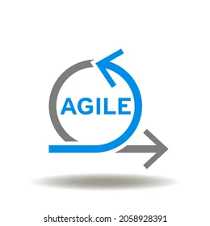

# 👋 Hi there, I’m Deepakshi Indresh!

🎓 Graduate Student | 📊 Aspiring Data Scientist & Analyst | 🌐 USA

---

## 👩‍💻 About Me

I’m currently pursuing my **Master’s in Data Science** at *Illinois Institute of Technology, Chicago*.  
I’m passionate about using data to solve real-world problems and support impactful, data-driven decision-making.

🔍 I’m actively looking for **Data Scientist** and **Data Analyst** roles where I can contribute my analytical mindset and technical expertise to drive business insights and solutions.

---

## 🛠️ Languages, Tools & Technologies

<!-- 🛠️ Languages, Tools & Technologies -->

  <!-- Programming Languages -->
  
  
  
  
  
  
  
  

    

  <!-- Microsoft & BI Tools -->
  
  
  
  
  

    

  <!-- ML & Libraries -->
  
  
  
  
  
  
  
  

    

  <!-- Databases -->
  
  
  
  
  

    

  <!-- Big Data -->
  
  
  
  
  

    

  <!-- Cloud & DevOps -->
  
  
  
  
  
  

---

## 🤝 Connect With Me

  
  &nbsp;&nbsp;
  

---

<em>“Turning data into stories that make a difference.”</em>

